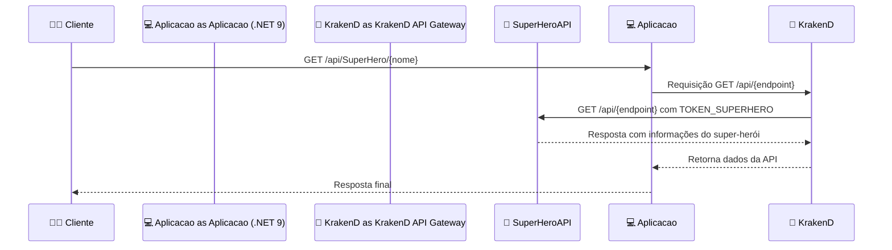

# 🐙 KrakenD-PoC 🚀

Este projeto é uma prova de conceito (PoC) para demonstrar a configuração e uso do [KrakenD](https://www.krakend.io/), um API Gateway de alto desempenho e código aberto.

## 📝 Descrição

O objetivo deste repositório é fornecer um exemplo prático de como configurar o KrakenD para gerenciar e expor múltiplos serviços backend através de uma única interface de API Gateway.

A PoC consiste em uma aplicação .NET 9 que expõe um endpoint para buscar informações sobre super-heróis usando a API pública [SuperHeroAPI](https://www.superheroapi.com/). O fluxo de requisições é mediado pelo KrakenD, que redireciona as chamadas para a API pública de forma segura e centralizada.

## 📁 Estrutura do Projeto

- `src/`: Contém o código-fonte da aplicação .NET 9.
- `krakend.json`: Arquivo de configuração do KrakenD.
- `docker-compose.yml`: Arquivo para orquestração dos serviços usando Docker Compose.

## ⚙️ Pré-requisitos

- 🐳 [Docker](https://www.docker.com/get-started)
- 📦 [Docker Compose](https://docs.docker.com/compose/install/)

## 🔧 Configuração

1. **Crie um arquivo `.env` na raiz do projeto com as seguintes variáveis de ambiente:**

    ```env
    HeroApiOptions__Host=<URL da API onde vamos bater>
    HeroApiOptions__Token=<Token para acessar essa API>
    Application__Host=<URL da aplicação>
    ```

    Substitua `<URL da API onde vamos bater>` pela URL do KrakenD (http://host.docker.internal:8080/api), `<Token para acessar essa API>` pelo token gerado ao registrar-se na SuperHeroAPI e `<URL da aplicação>` pela URL da API (https://host.docker.internal:8003).

2. Certifique-se de que o arquivo `.env` seja referenciado corretamente pelo Docker Compose.

## ▶️ Como Executar

1. **Clone o repositório:**

   ```bash
   git clone https://github.com/caiquefirefox/KrakenD-PoC.git
   cd KrakenD-PoC
   ```

2. **Inicie os serviços com Docker Compose:**

   ```bash
   docker-compose up --build
   ```

3. **Acesse os serviços:**

   - 🌐 Aplicação .NET 9: `http://localhost:8003`
   - 🚀 API Gateway KrakenD: `http://localhost:8080`

4. **Endpoint disponível:**

   - `GET /api/SuperHero/{nome}`: Busca informações sobre um super-herói pelo nome, utilizando a base de dados da API pública SuperHeroAPI. Exemplo:

     ```bash
     curl http://localhost:8003/api/SuperHero/Batman
     ```

## 🔄 Fluxo da Aplicação

A sequência de chamadas segue o seguinte fluxo:

1. 🧑‍💻 O cliente realiza uma requisição para `http://localhost:8003/api/SuperHero/{nome}`.
2. 🛠️ A aplicação .NET 9 recebe a requisição e redireciona para o KrakenD em `http://localhost:8080`.
3. 🌍 O KrakenD utiliza as variáveis de ambiente `URL_SUPERHERO` e `TOKEN_SUPERHERO` para autenticar e realizar uma requisição na SuperHeroAPI.
4. 🦸 A resposta da SuperHeroAPI é retornada para a aplicação via KrakenD.
5. 📤 A aplicação retorna a resposta final ao cliente.

### 🔗 Diagrama de Sequência (Mermaid)



## 📚 Referências

- [📖 Documentação Oficial do KrakenD](https://www.krakend.io/docs/)
- [🦸 SuperHeroAPI](https://www.superheroapi.com/)
- [🐙 KrakenD no GitHub](https://github.com/krakendio/krakend-ce)

## 🛡️ Licença

Este projeto está licenciado sob a Licença MIT. Consulte o arquivo `LICENSE` para mais detalhes.

## 🤝 Contribuições

Contribuições são bem-vindas! Sinta-se à vontade para abrir issues e pull requests.
